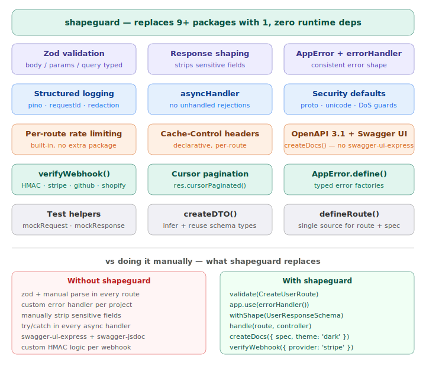
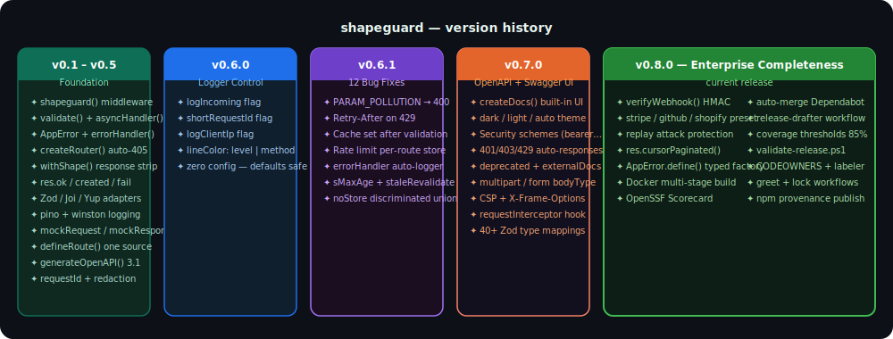
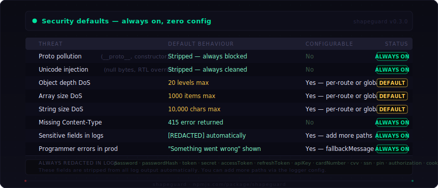

# shapeguard

> FastAPI-style validation, response shaping, and error handling for Node.js + Express.

Zero config to start. Fully configurable when you need it.
Strict by default. Lightweight. Production-ready.
Works in JavaScript and TypeScript. CommonJS and ESM.

[](https://npmjs.com/package/shapeguard)
[](https://npmjs.com/package/shapeguard)
[](https://bundlephobia.com/package/shapeguard)
[](./LICENSE)
[](https://npmjs.com/package/shapeguard)
[](https://github.com/kalyankashaboina/shapeguard/actions/workflows/ci.yml)
[](https://github.com/kalyankashaboina/shapeguard/actions/workflows/codeql.yml)
[](https://securityscorecards.dev/viewer/?uri=github.com/kalyankashaboina/shapeguard)
[](https://codecov.io/gh/kalyankashaboina/shapeguard)
[](https://github.com/kalyankashaboina/shapeguard/tree/main/docker)

---

## What's new in v0.8.1

> **Enterprise completeness.** Webhook verification, cursor pagination, typed error factories, and a fully-featured Swagger UI — all in one package with zero new dependencies.

```ts
// Webhook signature verification — Stripe, GitHub, Shopify, Svix, custom
import { verifyWebhook } from 'shapeguard'
router.post('/webhooks/stripe',
  verifyWebhook({ provider: 'stripe', secret: process.env.STRIPE_SECRET! }),
  handler,
)

// Cursor pagination — enterprise standard for large datasets
res.cursorPaginated({ data: users, nextCursor: users.at(-1)?.id ?? null, hasMore: true })

// Typed error factories — no more Record<string, unknown>
const PaymentError = AppError.define<{ amount: number }>('PAYMENT_FAILED', 402)
throw PaymentError({ amount: 9.99 })

// Built-in Swagger UI — zero extra packages, dark theme, CSP headers
app.use('/docs', createDocs({ spec, theme: 'dark' }))
```

[→ Full changelog](./CHANGELOG.md) · [→ Migration guide](./MIGRATION.md)

---

## Why shapeguard



Every Node.js + Express app repeats the same setup:

- Manual `if (!req.body.email)` checks scattered everywhere
- Error responses with different shapes per developer
- `passwordHash` leaking because someone forgot to strip it
- `req.body` typed as `any` — no IDE help, no safety
- Unhandled promise rejections silently hanging requests in Express 4
- DB error messages exposed to clients in production

shapeguard fixes all of this permanently — once, at setup.

---

## Install

```bash
npm install shapeguard zod
```

```bash
# Optional — structured production logging
npm install pino pino-pretty
```

If pino is not installed, shapeguard uses a built-in console logger with the same format automatically. No config change needed.

---

## The one rule that matters most

**Every piece works standalone. Use only what you need.**

You do not need to adopt everything at once. Each function works independently with zero setup:

```ts
// Only want typed validation? That's all you need.
import { validate, defineRoute } from 'shapeguard'
router.post('/users', validate(CreateUserRoute), handler)

// Only want consistent errors? That's all you need.
import { AppError, errorHandler } from 'shapeguard'
app.use(errorHandler())
throw AppError.notFound('User')

// Only want Swagger for an existing app? That's all you need.
import { generateOpenAPI } from 'shapeguard'
const spec = generateOpenAPI({ title: 'My API', version: '1.0.0', routes: { ... } })

// Only want unit-testable controllers? That's all you need.
import { mockRequest, mockResponse } from 'shapeguard/testing'

// Use all of it? Also fine.
app.use(shapeguard())
```

Pick one feature. Get full value from it immediately. Add more when you need them.

---



## Peer dependencies

| Package       | Required | Notes                             |
|---------------|----------|-----------------------------------|
| `express`     | Yes      | Primary target                    |
| `zod`         | Yes      | Schema validation                 |
| `pino`        | Optional | Richer logging if installed       |
| `pino-pretty` | Optional | Pretty dev logs with pino         |
| `joi`         | Optional | Via `shapeguard/adapters/joi`     |
| `yup`         | Optional | Via `shapeguard/adapters/yup`     |
| `winston`     | Optional | Via `shapeguard/adapters/winston` |

---

## Quick start — full setup

### 1. Mount in app.ts

```ts
import express from 'express'
import { shapeguard, notFoundHandler, errorHandler } from 'shapeguard'

const app = express()
app.use(express.json())
app.use(shapeguard())         // logging, requestId, res helpers — zero config
app.use('/api/users', userRouter)
app.use(notFoundHandler())    // 404 for unmatched routes
app.use(errorHandler())       // catches everything thrown anywhere — always last
app.listen(3000)
```

### 2. Define schemas once

```ts
// validators/user.validator.ts
import { z } from 'zod'
import { defineRoute, createDTO } from 'shapeguard'

// createDTO() infers the TypeScript type automatically — no manual z.infer needed
const CreateUserDTO = createDTO(z.object({
  email:    z.string().email(),
  name:     z.string().min(1).max(100),
  password: z.string().min(8),
}))

const UserResponseSchema = z.object({
  id:        z.string().uuid(),
  email:     z.string(),
  name:      z.string(),
  createdAt: z.string().datetime(),
  // passwordHash NOT here → stripped from response automatically
})

export const CreateUserRoute = defineRoute({
  body:      CreateUserDTO,
  response:  UserResponseSchema,
  // transform runs after validation, before your handler
  transform: async (data) => ({
    ...data,
    password: await bcrypt.hash(data.password, 10),
  }),
})

export type CreateUserBody = typeof CreateUserDTO.Input  // ← no z.infer needed
export type UserResponse   = z.infer<typeof UserResponseSchema>
```

### 3. Validate and handle in one step

```ts
import { handle, AppError } from 'shapeguard'
import { CreateUserRoute } from '../validators/user.validator'

export const createUser = handle(CreateUserRoute, async (req, res) => {
  req.body.email   // string — fully typed ✅
  req.body.isAdmin // TypeScript error — not in schema ✅

  const user = await UserService.create(req.body)
  res.created({ data: user, message: 'User created' })
  // passwordHash stripped by response schema automatically ✅
})
```

> `handle()` combines `validate()` + `asyncHandler()` into one call.
> The two-element array pattern still works — migrate at your own pace.

### 4. Throw errors from anywhere

```ts
import { AppError } from 'shapeguard'

async create(data: CreateUserBody) {
  const exists = await db.findByEmail(data.email)
  if (exists) throw AppError.conflict('Email')
  // → client sees { success: false, error: { code: "CONFLICT" } } — 409

  return db.create(data)
  // unhandled crash → client sees "Something went wrong" in prod
  // full stack trace in logger only — never exposed ✅
}
```

### 5. Routes with auto 405

```ts
import { createRouter } from 'shapeguard'

const router = createRouter()  // drop-in for express.Router()

router.post('/',      ...UserController.createUser)
router.get('/',       ...UserController.listUsers)
// DELETE / → 405 Method Not Allowed, Allow: GET, POST — automatic

router.get('/:id',    ...UserController.getUser)
router.put('/:id',    ...UserController.updateUser)
router.delete('/:id', ...UserController.deleteUser)
// POST /:id → 405, Allow: GET, PUT, DELETE — param routes included

export default router
```

---

## Standalone usage — adopt one piece at a time

### Just validation

No `shapeguard()` needed. Works with any existing Express app.

```ts
import { validate, defineRoute, AppError, errorHandler } from 'shapeguard'
import { z } from 'zod'

const CreateUserRoute = defineRoute({
  body: z.object({ email: z.string().email(), name: z.string() }),
})

router.post('/users', validate(CreateUserRoute), async (req, res) => {
  // req.body is typed — email and name guaranteed present and valid
  res.json({ ok: true })
})

app.use(errorHandler()) // catches 422 validation errors automatically
```

### Just error handling

No schemas, no validation. Consistent error shapes across your whole app.

```ts
import { AppError, errorHandler, isAppError } from 'shapeguard'

// Throw from anywhere — service, middleware, controller
throw AppError.notFound('User')
throw AppError.unauthorized()
throw AppError.conflict('Email')
throw AppError.custom('PAYMENT_FAILED', 'Payment declined', 402)

app.use(errorHandler({
  debug: false,                    // hide stack traces in prod
  errors: {
    fallbackMessage: 'Server error', // shown for non-operational errors
    onError: (err, req) => {
      Sentry.captureException(err)   // hook into your alerting
    },
  },
}))
```

### Just Swagger — for existing Express apps

**Minimum: 3 lines. Zero changes to your existing routes. No `defineRoute()` required.**

```ts
import { generateOpenAPI, createDocs } from 'shapeguard'

// Describe your API — your existing routes are completely untouched
const spec = generateOpenAPI({
  title:   'My API',
  version: '1.0.0',
  routes: { 'GET /users': { summary: 'List users' } },
})

// Swagger UI — one line. No swagger-ui-express. No extra packages.
app.use('/docs', createDocs({ spec }))
```

That's it. Open `http://localhost:3000/docs`.

**With Zod schemas and security** (still no `defineRoute` needed):

```ts
import { generateOpenAPI, createDocs } from 'shapeguard'
import { z } from 'zod'

const spec = generateOpenAPI({
  title:   'My API',
  version: '1.0.0',
  prefix:  '/api/v1',

  // Security — padlock button works immediately
  security:        { bearer: { type: 'http', scheme: 'bearer', bearerFormat: 'JWT' } },
  defaultSecurity: ['bearer'],

  routes: {
    'POST /users': {
      summary:  'Create user',
      tags:     ['Users'],
      security: [],  // override: public endpoint
      body:     z.object({ email: z.string().email(), name: z.string() }),
      response: z.object({ id: z.string(), email: z.string() }),
    },
    'GET /users/:id': {
      summary:  'Get user',
      tags:     ['Users'],
      response: z.object({ id: z.string(), email: z.string() }),
    },
  },
})

// Dark theme, custom title, CSP headers, no extra packages
app.use('/docs', createDocs({ spec, title: 'My API', theme: 'dark' }))
// Raw JSON for Postman, Insomnia, Stoplight, SDK generators
app.get('/docs/openapi.json', (_req, res) => res.json(spec))
```

Your existing routes are untouched. You only describe them for the spec.
`createDocs` is a standalone Express middleware — no `shapeguard()` setup needed.

→ [Full OpenAPI docs](./docs/OPENAPI.md) · [Security schemes](./docs/OPENAPI.md#security)

### Just unit testing

No HTTP server needed. Test controllers in pure Node.

```ts
import { mockRequest, mockResponse, mockNext } from 'shapeguard/testing'
import { createUser } from '../controllers/user.controller'

it('returns 201 with user data', async () => {
  const req  = mockRequest({ body: { email: 'alice@example.com', name: 'Alice' } })
  const res  = mockResponse()
  const next = mockNext()

  await createUser(req, res, next)

  expect(res._result().statusCode).toBe(201)
  expect(res._result().body.data.email).toBe('alice@example.com')
  expect(next.called).toBe(false)
})
```

### Just Winston logging

```ts
import winston from 'winston'
import { winstonAdapter } from 'shapeguard/adapters/winston'

const wLogger = winston.createLogger({
  transports: [new winston.transports.Console()],
})

app.use(shapeguard({
  logger: { instance: winstonAdapter(wLogger) },
}))
```

---

## What you get for free

```
shapeguard() mounted
  ✅ Structured logging          dev: pretty  |  prod: JSON lines
  ✅ Time-ordered requestId      every request, traceable end-to-end
  ✅ Request logging             method, endpoint pattern, status, duration
  ✅ res helpers                 res.ok / res.created / res.fail on every route
  ✅ Default redaction           passwords, tokens, cookies never appear in logs

validate() on a route
  ✅ req.body typed              no more any — full IDE autocomplete
  ✅ Unknown fields stripped     passwordHash gone before handler runs
  ✅ Fail fast                   first invalid field → 422 → handler never called
  ✅ Response stripping          response schema removes server-only fields
  ✅ Pre-parse guards            proto pollution, depth DoS, array/string size limits

AppError thrown anywhere
  ✅ errorHandler catches it     always consistent { success, message, error } shape
  ✅ Operational → shown         client sees your message
  ✅ Programmer → hidden in prod "Something went wrong" — stack in logs only

errorHandler() mounted
  ✅ One error shape always      frontend writes one handler — forever
  ✅ 4xx → logger.warn           expected, low noise
  ✅ 5xx → logger.error + stack  unexpected, full detail for debugging
  ✅ onError hook                plug in Sentry, Datadog, PagerDuty
```

---

## Response shapes — always consistent

```ts
// SUCCESS — res.ok() / res.created() / res.paginated()
{ "success": true, "message": "User created", "data": { "id": "...", "email": "..." } }

// PAGINATED — res.paginated()
{ "success": true, "message": "", "data": { "items": [...], "total": 42, "page": 1, "limit": 20, "pages": 3 } }

// ERROR — thrown AppError or validation failure
{ "success": false, "message": "Validation failed",
  "error": { "code": "VALIDATION_ERROR", "message": "Validation failed",
             "details": { "field": "email", "message": "Invalid email" } } }
```

Frontend writes this once and handles every endpoint:

```ts
const { success, data, error } = response.data
if (!success) handleError(error.code, error.message)
```

---

## Logging

```
# Development — human readable, colour-coded, one line per event
09:44:57.123  [DEBUG]  >>  POST    /api/v1/users                       [req_019c...]
09:44:57.125  [INFO]   <<  201  POST    /api/v1/users           2ms   [req_019c...]
09:44:57.400  [WARN]   <<  404  GET     /api/v1/users/xx       12ms   [req_019c...]
09:44:57.900  [ERROR]  <<  500  GET     /api/v1/crash           1ms   [req_019c...]
09:44:57.800  [WARN]   <<  200  GET     /api/v1/data         1523ms   [req_019c...]  SLOW

# Production — one JSON line per event (Datadog / CloudWatch / Loki / Splunk ready)
{"level":"info","time":"...","requestId":"req_019c...","method":"POST","endpoint":"/api/v1/users","status":201,"duration_ms":2}
```

`>>` = request arriving &nbsp;|&nbsp; `<<` = response leaving &nbsp;|&nbsp; `SLOW` = exceeded `slowThreshold`

### Logger config

```ts
app.use(shapeguard({
  logger: {
    // Output control
    logAllRequests:  true,    // log every request (default: true dev, false prod — errors+slow only)
    logIncoming:     true,    // show >> arrival lines (default: true)
    slowThreshold:   500,     // SLOW warning threshold ms (default: 500 dev, 1000 prod)

    // Request ID display
    logRequestId:    true,    // show [req_id] on every line (default: true)
    shortRequestId:  false,   // show last 8 chars only — [3a3045a] (default: false)

    // Extra fields
    logClientIp:     false,   // log client IP on response lines (default: false)

    // Colour mode (dev/pretty output only)
    lineColor:       'method', // 'method' = colour by verb | 'level' = colour by status

    // Body logging — off by default (security risk)
    logRequestBody:  false,   // include req.body (auto-redacted)
    logResponseBody: false,   // include response body

    // Bring your own logger (pino, winston, console-compatible)
    // instance: winstonAdapter(wLogger),

    // Suppress all logs — useful in test environments
    // silent: true,
  },
  requestId: {
    header:    'x-request-id',          // read from upstream (load balancer / gateway)
    // generator: () => crypto.randomUUID(),  // custom ID format
    // enabled:   false,                      // disable entirely
  },
  response: {
    includeRequestId: true,   // send X-Request-Id header on every response
  },
}))
```

---

## OpenAPI / Swagger

Auto-generate an OpenAPI 3.1 spec. Zero manual schema duplication. Built-in Swagger UI — no extra package needed.

```ts
import { generateOpenAPI, createDocs } from 'shapeguard'

const spec = generateOpenAPI({
  title:   'My API',
  version: '1.0.0',
  prefix:  '/api/v1',             // written once, applied to all routes

  // Security — padlock button works out of the box
  security: { bearer: { type: 'http', scheme: 'bearer', bearerFormat: 'JWT' } },
  defaultSecurity: ['bearer'],

  routes: {
    'POST /users': {
      ...defineRoute({ body: CreateUserDTO, response: UserResponseSchema }),
      summary:  'Create a new user',
      tags:     ['Users'],
      security: [],  // public endpoint — no auth needed
    },
    'GET /users/:id': {
      summary:  'Get user by ID',
      tags:     ['Users'],
      response: UserResponseSchema,
    },
  },
})

// Built-in Swagger UI — dark/light/auto theme, CSP headers, no swagger-ui-express needed
app.use('/docs', createDocs({ spec, title: 'My API', theme: 'dark' }))
// Raw JSON spec for Postman, Insomnia, Stoplight, SDK generators
app.get('/docs/openapi.json', (_req, res) => res.json(spec))
```

Each operation gets a stable `operationId` automatically (`POST /users` → `postUsers`). Security schemes, 400/401/403/429 responses, deprecated flags, and multipart/form-data are all supported.

→ [Full OpenAPI docs](./docs/OPENAPI.md)

---

## Security defaults



| Threat | Default | Configurable |
|--------|---------|--------------|
| Proto pollution (`__proto__`, `constructor`) | Stripped always | No — security invariant |
| Unicode injection (null bytes, RTL override) | Stripped always | No — security invariant |
| Object depth DoS | 20 levels max | Yes — per-route or global |
| Array size DoS | 1000 items max | Yes |
| String size DoS | 10,000 chars max | Yes |
| Missing Content-Type on POST/PUT/PATCH | 415 error | No — always enforced |
| Sensitive fields in logs | `[REDACTED]` | Add more paths via `redact` |
| Programmer errors in prod | Message hidden | `fallbackMessage` to customise |

---

## Full API reference

### Tier 1 — daily use

```ts
import {
  handle,            // validate + asyncHandler in one — recommended
  validate,          // request validation + response stripping middleware
  asyncHandler,      // async safety wrapper for Express 4
  AppError,          // throw typed errors from anywhere in your app
  defineRoute,       // bundle all schemas for a route into one reusable object
  createDTO,         // z.object() wrapper with automatic TypeScript type inference
  generateOpenAPI,   // generate OpenAPI 3.1 spec from route definitions
  isAppError,        // type guard — check if unknown is AppError
  ErrorCode,         // stable error code string constants
} from 'shapeguard'
```

### Tier 2 — mount once

```ts
import {
  shapeguard,        // main middleware — logging, requestId, res helpers
  errorHandler,      // centralised error handler — always mount last
  notFoundHandler,   // 404 handler for unmatched routes
  createRouter,      // drop-in for express.Router() with auto 405
} from 'shapeguard'
```

### Tier 3 — adapters and special cases

```ts
import {
  withShape,         // override response shape for a specific route
  zodAdapter,        // manually wrap a Zod schema into a SchemaAdapter
  isZodSchema,       // detect whether a value is a Zod schema
} from 'shapeguard'

// Schema library adapters
import { joiAdapter }     from 'shapeguard/adapters/joi'      // Joi → SchemaAdapter
import { yupAdapter }     from 'shapeguard/adapters/yup'      // Yup → SchemaAdapter
import { winstonAdapter } from 'shapeguard/adapters/winston'  // Winston → Logger

// Testing utilities — no Express, no HTTP needed
import { mockRequest, mockResponse, mockNext } from 'shapeguard/testing'
```

### TypeScript types

```ts
import type {
  // Config
  ShapeguardConfig,    // full shapeguard() config
  LoggerConfig,        // logger sub-config
  ValidationConfig,    // validation sub-config
  ResponseConfig,      // response sub-config
  ErrorsConfig,        // error handler sub-config

  // Schema
  SchemaAdapter,       // interface for custom schema adapters
  RouteSchema,         // defineRoute() result shape
  SafeParseResult,     // adapter parse result
  ValidationIssue,     // { field, message, code }

  // Response envelopes
  SuccessEnvelope,     // { success: true, message, data }
  ErrorEnvelope,       // { success: false, message, error }
  Envelope,            // SuccessEnvelope | ErrorEnvelope
  PaginatedData,       // { items, total, page, limit, pages }

  // Logger
  Logger,              // { info, warn, error, debug }
  LogLevel,            // 'debug' | 'info' | 'warn' | 'error'

  // Type inference helpers — extract types from defineRoute() output
  InferBody,           // type Body    = InferBody<typeof MyRoute>
  InferParams,         // type Params  = InferParams<typeof MyRoute>
  InferQuery,          // type Query   = InferQuery<typeof MyRoute>
  InferHeaders,        // type Headers = InferHeaders<typeof MyRoute>
} from 'shapeguard'
```

---

## Bundle size

```
shapeguard core   ~12kb gzip   — zero required runtime dependencies, tree-shakeable
pino (optional)   ~8kb  gzip   — structured JSON logging
total             ~20kb gzip
```

---

## Full documentation

| Doc | What's inside |
|-----|---------------|
| [VALIDATION.md](./docs/VALIDATION.md) | validate(), handle(), defineRoute(), createDTO(), transform, allErrors, rateLimit, cache, Joi/Yup adapters |
| [OPENAPI.md](./docs/OPENAPI.md) | generateOpenAPI(), prefix, operationId, tags, summary, inline schemas, Swagger UI setup |
| [TESTING.md](./docs/TESTING.md) | mockRequest(), mockResponse(), mockNext(), unit testing controllers without Express |
| [ERRORS.md](./docs/ERRORS.md) | AppError, errorHandler, all error codes, operational vs programmer errors |
| [LOGGING.md](./docs/LOGGING.md) | pino, requestId, logIncoming, shortRequestId, logClientIp, lineColor, Winston adapter |
| [RESPONSE.md](./docs/RESPONSE.md) | res.ok, res.created, res.paginated, withShape, full response envelope reference |
| [CONFIGURATION.md](./docs/CONFIGURATION.md) | every config option with defaults, type signatures, global vs per-route |
| [MIGRATION.md](./MIGRATION.md) | upgrade guides v0.1.x → v0.2.0 → v0.3.0 → v0.3.1 → v0.4.0 → v0.5.0 → v0.6.0 → v0.6.1 → v0.7.0 → v0.8.0 |
| [CHANGELOG.md](./CHANGELOG.md) | full version history |
| [SECURITY.md](./SECURITY.md) | vulnerability reporting policy |

---

## Docker

Run the example app locally with one command — no Node.js installation required.

```bash
# Clone the repo
git clone https://github.com/kalyankashaboina/shapeguard.git
cd shapeguard

# Start the example app + Redis (all Docker files live in docker/)
docker compose -f docker/docker-compose.yml up

# Open in browser:
# http://localhost:3000/docs              → Swagger UI (dark theme, padlock works)
# http://localhost:3000/docs/openapi.json → raw OpenAPI 3.1 spec
```

### Services

| Service | Port | Description |
|---------|------|-------------|
| `app` | 3000 | Example API with Swagger UI |
| `redis` | 6379 | Distributed rate limit store |
| `redis-commander` | 8081 | Redis web UI (optional — `--profile tools`) |

```bash
# Start with Redis UI (inspect rate limit state)
docker compose -f docker/docker-compose.yml --profile tools up

# Example app only (no Redis)
docker compose -f docker/docker-compose.yml up app

# Background mode
docker compose -f docker/docker-compose.yml up -d

# Tail logs
docker compose -f docker/docker-compose.yml logs -f app

# Stop and remove containers + volumes
docker compose -f docker/docker-compose.yml down
```

Or use the npm scripts shorthand — they wrap the full paths for you:

```bash
npm run docker:up        # docker compose -f docker/docker-compose.yml up
npm run docker:up:bg     # ... up -d
npm run docker:down      # ... down
npm run docker:logs      # ... logs -f app
npm run docker:tools     # ... --profile tools up
npm run docker:build     # docker build -f docker/Dockerfile -t shapeguard-example .
npm run docker:clean     # ... down -v --rmi local  (removes volumes + images)
```

### Docker file structure

All Docker files live in `docker/` to keep the repo root clean:

```
docker/
  Dockerfile          ← multi-stage build (deps → builder → example)
  docker-compose.yml  ← app + Redis + Redis Commander
  .dockerignore       ← excludes node_modules, dist, test files
```

The `Dockerfile` uses three stages:

- **`deps`** — installs all npm packages with layer caching
- **`builder`** — compiles TypeScript → `dist/`, prunes to prod deps
- **`example`** — minimal Alpine image, non-root user (`shapeguard:1001`), health check

---

## Examples

> Examples live on GitHub — not included in the npm package.

| Example | What it shows |
|---------|---------------|
| [basic-crud-api](./examples/basic-crud-api/) | Full CRUD API — all features working end to end |
| [handle-and-dto](./examples/handle-and-dto/) | `handle()` + `createDTO()` — less boilerplate per route |
| [transform-hook](./examples/transform-hook/) | Password hashing, slug generation via `transform` |
| [global-config](./examples/global-config/) | `validation.strings`, `logger.silent`, custom request ID |
| [with-openapi](./examples/with-openapi/) | `generateOpenAPI()` + `createDocs()` + `verifyWebhook()` + `cursorPaginated()` |
| [with-webhook](./examples/with-webhook/) | `verifyWebhook()` — Stripe, GitHub, Shopify, Svix, custom providers |
| [with-testing](./examples/with-testing/) | `mockRequest()` / `mockResponse()` controller unit tests |

---

## Security

shapeguard is a security-focused library. Every input validation feature is a security feature.

See [SECURITY.md](./SECURITY.md) for the vulnerability reporting policy.

**Supply chain:** every release is published with npm provenance (`--provenance` flag) and passes [OpenSSF Scorecard](https://securityscorecards.dev/viewer/?uri=github.com/kalyankashaboina/shapeguard) checks. The CI pipeline runs CodeQL static analysis on every push to `main`.

---

## License

MIT © 2026 [Kalyan Kashaboina](https://github.com/kalyankashaboina)