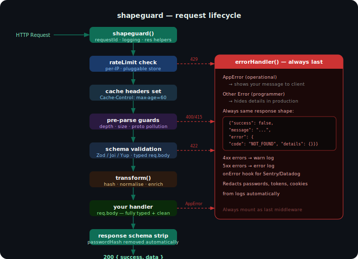
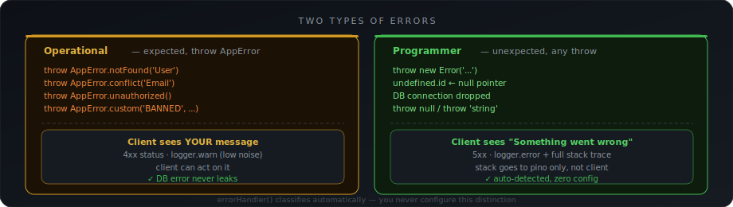

# Errors — shapeguard

> AppError, errorHandler, operational vs programmer errors.

---

## Table of contents

- [Two types of errors](#two-types)
- [AppError](#apperror)
- [Built-in factories](#factories)
- [Custom errors](#custom)
- [Error flow](#flow)
- [errorHandler()](#errorhandler)
- [notFoundHandler()](#notfound)
- [asyncHandler()](#asynchandler)
- [Legacy error class](#legacy)
- [All error codes](#codes)
- [Edge cases](#edge-cases)

---



## Two types of errors <a name="two-types"></a>

[]

```
OPERATIONAL                         PROGRAMMER
────────────────────────────────    ────────────────────────────────
Expected. Part of normal flow.      Unexpected. Your code broke.

User sends bad email                DB connection dropped
Resource not found                  Null pointer / undefined access
Wrong password                      Redis timeout
Duplicate email                     Third party API crashed
Invalid coupon                      Unhandled promise rejection
Missing required field              Memory overflow

Client can act on it                Client cannot act on it
Show your message                   Show "Something went wrong"
4xx status codes                    5xx status codes
logger.warn — low noise             logger.error — full stack trace
```

### How shapeguard decides

```ts
// AppError → always operational → message shown to client
throw AppError.notFound('User')       // operational
throw AppError.conflict('Email')      // operational
throw AppError.custom('BANNED', ...)  // operational

// anything else → programmer → hidden in prod
throw new Error('...')                // programmer
throw null                            // programmer
throw 'string'                        // programmer
new TypeError('...')                  // programmer

// in production
// → { "error": { "code": "INTERNAL_ERROR", "message": "Something went wrong" }}
// → full stack trace → pino logger only

// in development
// → { "error": { "code": "INTERNAL_ERROR", "message": "actual error message",
//                "details": "stack trace here" }}
```

---

## AppError <a name="apperror"></a>

Single error class. Throw it anywhere — controller, service, repository, middleware.
errorHandler catches everything.

```ts
import { AppError } from 'shapeguard'

// basic
throw new AppError('USER_BANNED', 'User is banned', 403)
//                  code           message           status

// with details
throw new AppError('PAYMENT_FAILED', 'Card declined', 402, {
  retryAfter: 30,
  lastFour:   '4242',
})
```

### Properties

```ts
err.code        // string — stable, safe to match client-side
err.message     // string — shown to client
err.statusCode  // number — HTTP status
err.details     // object | null — extra info, sanitized in prod
err.isAppError  // true — used for cross-module instanceof check
```

---

## Built-in factories <a name="factories"></a>

```ts
// 404 — resource not found
throw AppError.notFound('User')
// → { code: 'NOT_FOUND', message: 'User not found', status: 404 }

throw AppError.notFound()
// → { code: 'NOT_FOUND', message: 'Resource not found', status: 404 }

// 401 — not authenticated
throw AppError.unauthorized()
// → { code: 'UNAUTHORIZED', message: 'Authentication required', status: 401 }

throw AppError.unauthorized('Token expired')
// → { code: 'UNAUTHORIZED', message: 'Token expired', status: 401 }

// 403 — authenticated but not allowed
throw AppError.forbidden()
// → { code: 'FORBIDDEN', message: 'Access denied', status: 403 }

throw AppError.forbidden('Admin only')
// → { code: 'FORBIDDEN', message: 'Admin only', status: 403 }

// 409 — duplicate / conflict
throw AppError.conflict('Email')
// → { code: 'CONFLICT', message: 'Email already exists', status: 409 }

// 422 — validation failure (used internally by validate())
throw AppError.validation(issues)
// → { code: 'VALIDATION_ERROR', message: 'Validation failed', status: 422,
//     details: { field: 'email', message: 'Invalid email' }}

// 500 — operational server error (message shown)
throw AppError.internal('Payment service unavailable')
// → { code: 'INTERNAL_ERROR', message: 'Payment service unavailable', status: 500 }

// any — fully custom
throw AppError.custom('INVALID_COUPON', 'Coupon has expired', 400)
throw AppError.custom('ACCOUNT_LOCKED', 'Too many attempts',  423, { retryAfter: 300 })
throw AppError.custom('PAYMENT_FAILED', 'Card was declined',  402)
```

---

## Custom errors <a name="custom"></a>

Two patterns — pick one:

### Pattern A — AppError.custom() — simple, no class needed

```ts
// in your service
throw AppError.custom('SUBSCRIPTION_EXPIRED', 'Your subscription has expired', 402)
throw AppError.custom('FEATURE_DISABLED',     'This feature is not available', 403)
throw AppError.custom('QUOTA_EXCEEDED',       'Monthly quota reached',         429, {
  resetAt: '2024-02-01T00:00:00Z'
})
```

### Pattern B — extend AppError — reusable, typed

```ts
// errors/payment.errors.ts
import { AppError } from 'shapeguard'

export class PaymentError extends AppError {
  constructor(message: string, details?: Record<string, unknown>) {
    super('PAYMENT_FAILED', message, 402, details ?? null)
  }
}

export class SubscriptionError extends AppError {
  constructor(message: string) {
    super('SUBSCRIPTION_EXPIRED', message, 402)
  }
}

// usage in service
throw new PaymentError('Card was declined', { lastFour: '4242' })
throw new SubscriptionError('Your subscription has expired')
// both caught by errorHandler — same response shape
```

---

## Error flow <a name="flow"></a>

```
ANYWHERE IN YOUR CODE
  throw AppError.notFound('User')
  throw AppError.conflict('Email')
  throw new Error('db crashed')
         │
         │  asyncHandler catches all throws from async routes
         │  next(err) called automatically
         ▼
  Express error middleware chain
         │
         ▼
  errorHandler()   ← your single error handler
         │
         ├── isAppError?
         │     YES → operational
         │           → send err.message to client
         │           → logger.warn (4xx) or logger.error (5xx)
         │
         └── not AppError → programmer error
               → prod: send "Something went wrong"
               → dev:  send actual message + stack
               → logger.error with full stack always
```

---

## errorHandler() <a name="errorhandler"></a>

Mount once. Last middleware. Catches everything.

```ts
// basic
app.use(errorHandler())
```

```ts
// configurable
app.use(errorHandler({
  // custom message for programmer errors in prod
  fallbackMessage: 'Something went wrong',

  // hook — fires after every error
  // use for Sentry, Datadog, PagerDuty, alerting
  onError: (err: AppError, req: Request) => {
    Sentry.captureException(err, {
      extra: {
        requestId: req.id,
        path:      req.path,
        method:    req.method,
      }
    })
  }
}))
```

### What errorHandler logs

```ts
// operational (4xx) — warn, no stack
{
  level:      'warn',
  requestId:  'req_01j8xk9m2p',
  code:       'NOT_FOUND',
  method:     'GET',
  endpoint:   '/api/users/:id',   // route pattern, not /api/users/actual-id
  status:     404,
  duration_ms: 3,
}

// programmer (5xx) — error, full stack
{
  level:      'error',
  requestId:  'req_01j8xk9m2p',
  code:       'INTERNAL_ERROR',
  method:     'POST',
  endpoint:   '/api/orders',
  status:     500,
  duration_ms: 45,
  message:    'Cannot read properties of undefined',
  stack:      'Error: Cannot read...\n  at UserService...',
  cause:      { message: '...', stack: '...' }   // original error if wrapped
}
```

### What errorHandler sends to client

```ts
// operational — your message shown
{
  "success": false,
  "message": "User not found",
  "error": { "code": "NOT_FOUND", "message": "User not found", "details": null }
}

// programmer — sanitized in prod
{
  "success": false,
  "message": "Something went wrong",
  "error": { "code": "INTERNAL_ERROR", "message": "Something went wrong", "details": null }
}

// programmer — full detail in dev
{
  "success": false,
  "message": "Cannot read properties of undefined (reading 'id')",
  "error": {
    "code":    "INTERNAL_ERROR",
    "message": "Cannot read properties of undefined (reading 'id')",
    "details": "at UserService.create (src/services/user.service.ts:24:18)"
  }
}
```

---

## notFoundHandler() <a name="notfound"></a>

Catches requests that matched no route. Mount before errorHandler.

```ts
// basic
app.use(notFoundHandler())
// → 404 { "error": { "code": "NOT_FOUND", "message": "Cannot GET /api/unknown" }}
```

```ts
// configurable
app.use(notFoundHandler({
  message: 'Route not found',
}))
```

---

## asyncHandler() <a name="asynchandler"></a>

Express 4 does not catch async errors automatically.
Without this, unhandled rejections hang the request silently.

```ts
// ❌ WITHOUT asyncHandler — request hangs if db throws
app.get('/users', async (req, res) => {
  const users = await db.getUsers()   // throws → request hangs
  res.json(users)
})

// ✅ WITH asyncHandler — error goes to errorHandler
app.get('/users',
  asyncHandler(async (req, res) => {
    const users = await db.getUsers()   // throws → next(err) → errorHandler
    res.json(users)
  })
)
```

shapeguard's `validate()` already wraps handlers internally.
Use `asyncHandler` for routes without `validate()`.

---

## Legacy error class <a name="legacy"></a>

Already have your own AppError? Two options:

### Option A — extend (recommended)

```ts
// your existing class — just extend AppError
import { AppError } from 'shapeguard'

class MyAppError extends AppError {
  constructor(code: string, message: string, statusCode: number) {
    super(code, message, statusCode)
    // existing code unchanged
    // instanceof AppError → true → errorHandler catches it
  }
}

throw new MyAppError('USER_BANNED', 'User is banned', 403)
// → errorHandler catches it → same response shape
```

### Option B — wrap at boundary (zero migration)

```ts
import { AppError, isAppError } from 'shapeguard'

// existing throws stay exactly as they are
// wrap in errorHandler only
app.use((err, req, res, next) => {
  if (isAppError(err)) return next(err)

  // your legacy class
  if (err instanceof MyLegacyError) {
    return next(AppError.fromLegacy({
      code:       err.code,
      message:    err.message,
      statusCode: err.statusCode,
    }))
  }

  next(err)  // let shapeguard's errorHandler handle the rest
})

app.use(errorHandler())
```

---

## All error codes <a name="codes"></a>

Stable string codes — safe to match in frontend code.

| Code | HTTP | Source | When |
|------|------|--------|------|
| `VALIDATION_ERROR` | 422 | validate() | body/query/params/headers failed schema |
| `NOT_FOUND` | 404 | AppError | resource missing |
| `UNAUTHORIZED` | 401 | AppError | not authenticated |
| `FORBIDDEN` | 403 | AppError | not allowed |
| `CONFLICT` | 409 | AppError | duplicate resource |
| `INTERNAL_ERROR` | 500 | AppError / errorHandler | unhandled programmer error |
| `METHOD_NOT_ALLOWED` | 405 | createRouter | wrong HTTP method used |
| `BODY_TOO_DEEP` | 400 | pre-parse | object nesting > maxDepth |
| `BODY_ARRAY_TOO_LARGE` | 400 | pre-parse | array > maxArrayLength |
| `STRING_TOO_LONG` | 400 | pre-parse | string > maxStringLength |
| `INVALID_CONTENT_TYPE` | 415 | pre-parse | POST/PUT/PATCH without Content-Type |
| `PARAM_POLLUTION` | 400 | pre-parse | query param sent as array (?x=a&x=b) |
| `PROTO_POLLUTION` | 400 | pre-parse | `__proto__` in body |
| `RATE_LIMIT_EXCEEDED` | 429 | validate() | per-route rate limit hit |
| `WEBHOOK_SIGNATURE_MISSING` | 400 | verifyWebhook() | signature header absent |
| `WEBHOOK_SIGNATURE_INVALID` | 401 | verifyWebhook() | HMAC mismatch |
| `WEBHOOK_TIMESTAMP_MISSING` | 400 | verifyWebhook() | timestamp field absent (Stripe/Svix) |
| `WEBHOOK_TIMESTAMP_EXPIRED` | 400 | verifyWebhook() | timestamp outside tolerance window |

### `AppError.define()` — typed error factory

Create reusable, TypeScript-typed error constructors once. No more `Record<string, unknown>`.

```ts
// Define once — fully typed details payload
const PaymentError = AppError.define<{ amount: number; currency: string }>(
  'PAYMENT_FAILED', 402, 'Payment failed'
)

// Throw anywhere — TypeScript checks the shape
throw PaymentError({ amount: 9.99, currency: 'USD' })

// Override the message per-throw
throw PaymentError({ amount: 0, currency: 'USD' }, 'Card declined — insufficient funds')

// Clients receive:
// { success: false, error: { code: 'PAYMENT_FAILED', message: '...', details: { amount: 9.99, currency: 'USD' } } }
```

---

## Edge cases <a name="edge-cases"></a>

```
throw null                  → INTERNAL_ERROR 500, "Something went wrong" in prod
throw 'string'              → INTERNAL_ERROR 500, "Something went wrong" in prod
throw undefined             → INTERNAL_ERROR 500, "Something went wrong" in prod
re-throw AppError           → fromUnknown detects instanceof → passes through unchanged
pre-parse error (too deep)  → fromUnknown detects .isPreParse flag → 400 with real code
pre-parse INVALID_CONTENT_TYPE → promoted to 415 (not 500) with correct error code
error after res.ok()        → errorHandler sees headersSent → skips silently
error in errorHandler       → fallback hardcoded JSON → server never dies
subclass of AppError        → isAppError flag + instanceof both checked → works
AppError across modules     → isAppError: true flag handles dual-module edge case
```
