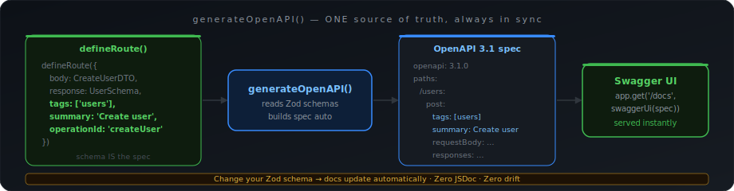

# OpenAPI — shapeguard

> Auto-generate an OpenAPI 3.1 spec from your `defineRoute()` definitions.
> No manual schema duplication — your route definitions ARE the spec.

---

## Table of contents

- [Quick start](#quick-start)
- [generateOpenAPI()](#generateopenapi)
- [Serving the spec](#serving)
- [Swagger UI](#swagger)
- [Full example](#example)

---



## Quick start <a name="quick-start"></a>

```ts
import { generateOpenAPI } from 'shapeguard'

const spec = generateOpenAPI({
  title:   'My API',
  version: '1.0.0',
  routes: {
    'POST   /users':     CreateUserRoute,
    'GET    /users':     ListUsersRoute,
    'GET    /users/:id': GetUserRoute,
    'PUT    /users/:id': UpdateUserRoute,
    'DELETE /users/:id': DeleteUserRoute,
  }
})

// Serve it
app.get('/docs/openapi.json', (_req, res) => res.json(spec))
```

---

## generateOpenAPI() <a name="generateopenapi"></a>

```ts
generateOpenAPI(config: OpenAPIConfig): OpenAPISpec
```

### Config options

```ts
{
  title:        string                                  // API title
  version:      string                                  // API version
  description?: string                                  // optional description
  servers?:     Array<{ url: string; description? }>    // server URLs
  routes:       Record<string, RouteDefinition>         // your defineRoute() outputs
}
```

### Route key format

```ts
// "METHOD /path" — method is case-insensitive
'POST   /users'
'GET    /users/:id'
'PUT    /users/:id'
'DELETE /users/:id'
'GET    /users'
```

Express `:param` syntax is automatically converted to OpenAPI `{param}` syntax.

### What gets generated

| Route has | OpenAPI generates |
|---|---|
| `params` schema | path parameters |
| `query` schema | query parameters |
| `body` schema | requestBody |
| `response` schema | 200 response with data shape |
| Always | 422 validation error, 500 internal error |

---

## Serving the spec <a name="serving"></a>

```ts
// Serve raw JSON — import into Postman, Insomnia, etc.
app.get('/docs/openapi.json', (_req, res) => res.json(spec))
```

---

## Swagger UI <a name="swagger"></a>

```bash
npm install swagger-ui-express
```

```ts
import swaggerUi from 'swagger-ui-express'

app.use('/docs', swaggerUi.serve, swaggerUi.setup(spec))
// Open: http://localhost:3000/docs
```

---

## Full example <a name="example"></a>

```ts
import express from 'express'
import { z } from 'zod'
import { shapeguard, createDTO, defineRoute, generateOpenAPI, notFoundHandler, errorHandler } from 'shapeguard'

const CreateUserDTO = createDTO(z.object({
  email:    z.string().email(),
  name:     z.string().min(1).max(100),
  password: z.string().min(8),
}))

const UserResponseSchema = z.object({
  id:        z.string().uuid(),
  email:     z.string().email(),
  name:      z.string(),
  createdAt: z.string().datetime(),
})

const UserParamsSchema = z.object({ id: z.string().uuid() })
const UserQuerySchema  = z.object({
  page:  z.coerce.number().default(1),
  limit: z.coerce.number().default(20),
})

const CreateUserRoute = defineRoute({ body: CreateUserDTO, response: UserResponseSchema })
const GetUserRoute    = defineRoute({ params: UserParamsSchema, response: UserResponseSchema })
const ListUsersRoute  = defineRoute({ query: UserQuerySchema })

// Generate spec from your existing route definitions — zero duplication
const spec = generateOpenAPI({
  title:   'Users API',
  version: '1.0.0',
  servers: [{ url: 'http://localhost:3000', description: 'Local' }],
  routes: {
    'POST /users':     CreateUserRoute,
    'GET  /users':     ListUsersRoute,
    'GET  /users/:id': GetUserRoute,
  }
})

const app = express()
app.use(express.json())
app.use(shapeguard())
app.get('/docs/openapi.json', (_req, res) => res.json(spec))
app.use(notFoundHandler())
app.use(errorHandler())
app.listen(3000)
```
